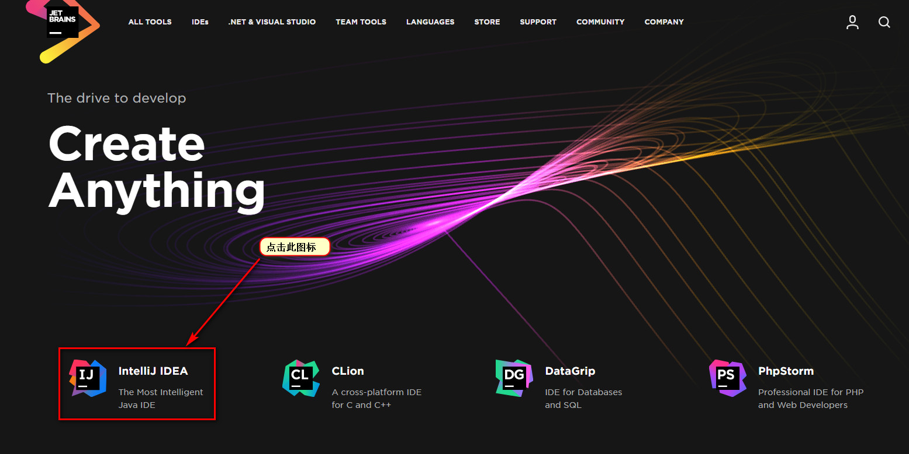
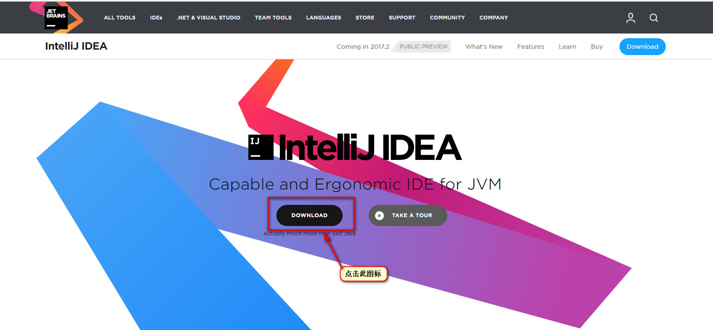
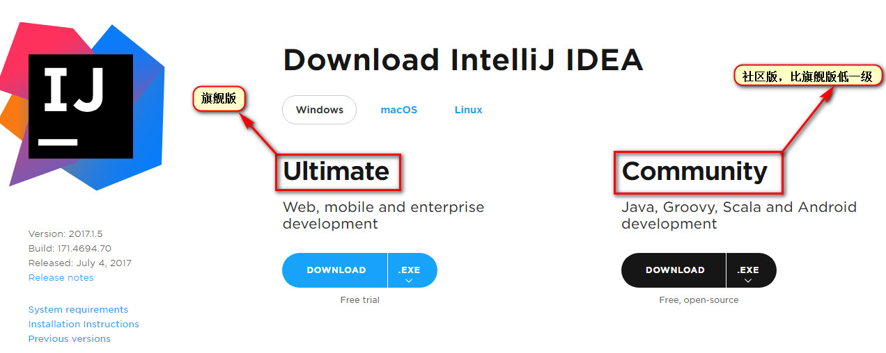
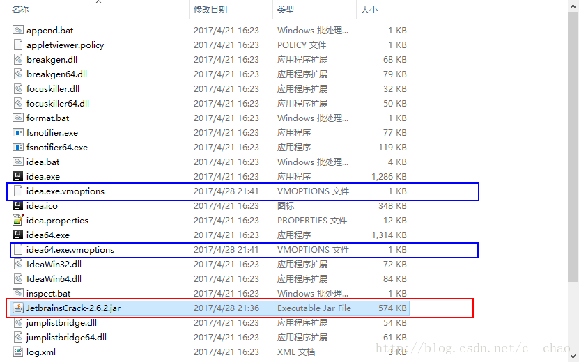

# Windows 系统下载 IntelliJ IDEA

- 1. 通过IntelliJ IDEA官网下载：<https://www.jetbrains.com>  
  
  
  
- 2. IDEA破解：
    - 百度下载一个JetbrainsCrack-2.6.2.jar 破解补丁。放在你的安装idea下面的bin的目录下面。
    - 下载链接：<http://idea.lanyus.com/>  
    - 在安装的idea下面的bin目录下面有2个文件 ： 一个是`idea64.exe.vmoptions`，还有一个是`idea.e
      xe.vmoptions`；详见下图：
        
    - 用记事本打开（蓝色框） 分别在最下面一行增加一行：  
        
        | -javaagent:E:\DevelopSoftware\IntelliJIDEA\IntelliJ IDEA 2017.1\bin\JetbrainsCrack-2.6.2.jar  |  
        | “F:\idea\IntelliJ IDEA 2017.1\bin\JetbrainsCrack-2.6.2.jar”是对应的JetbrainsCrack-2.6.2.jar的位置。|  
    - 重启一下软件，在进入出现有active code选择界面的时候 写入下面注册代码：（到2099年到期）  
    |ThisCrackLicenseId-{ "licenseId":"ThisCrackLicenseId", "licenseeName":"idea", "assigneeName":"", "assigneeEmail":"idea@163.com", "licenseRestriction":"For This Crack, Only Test! Please support genuine!!!", "checkConcurrentUse":false, "products":[ {"code":"II","paidUpTo":"2099-12-31"}, {"code":"DM","paidUpTo":"2099-12-31"}, {"code":"AC","paidUpTo":"2099-12-31"}, {"code":"RS0","paidUpTo":"2099-12-31"}, {"code":"WS","paidUpTo":"2099-12-31"}, {"code":"DPN","paidUpTo":"2099-12-31"}, {"code":"RC","paidUpTo":"2099-12-31"}, {"code":"PS","paidUpTo":"2099-12-31"}, {"code":"DC","paidUpTo":"2099-12-31"}, {"code":"RM","paidUpTo":"2099-12-31"}, {"code":"CL","paidUpTo":"2099-12-31"}, {"code":"PC","paidUpTo":"2099-12-31"} ], "hash":"2911276/0", "gracePeriodDays":7, "autoProlongated":false}
|